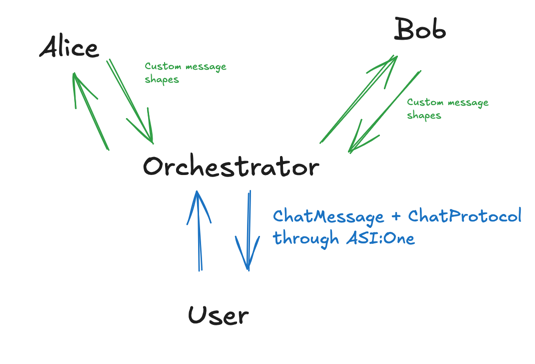

# fetch-help

Memory-support assistant for conversations with people you care about. It combines **face recognition** (enrollment + match), a **React (Vite) client** with camera/speech, a **FastAPI** backend, and optional **Fetch.ai uAgents** (Alice / Bob / orchestrator) for agent-mailbox workflows.

Conversation **synopses** and **reply suggestions** are generated with **Google Gemini** and stored in **MongoDB** when the API path is used. The person stored in the database is always keyed by the **name from face enrollment or match**, not a name guessed from the transcript.

---

## Architecture



| Piece | Role |
|--------|------|
| **Web client** (`client/`) | Camera, MediaPipe-style landmarks, speech-to-text, AR-style UI, calls REST API |
| **API** (`agents/api/server.py`) | Face enroll/match, process transcript → synopsis + suggestions, list people/synopses |
| **Alice** | uAgent: reply suggestions (Gemini) |
| **Bob (“Synthesizer”)** | uAgent: conversation synopsis + Mongo persistence |
| **Orchestrator** | uAgent: routes chat to Alice or Bob |

---

## Prerequisites

- **Python 3.12** (recommended)
- **Node.js 18+** (for the client)
- **MongoDB** (local or Atlas) — required for faces + conversation storage on the API path
- **Gemini API key** — required for synopsis and suggestions
- (Optional) **Agentverse / ASI1** accounts — for testing uAgents via Agent Inspector

---

## Environment

```bash
cp .env.example .env
```

| Variable | Purpose |
|----------|---------|
| `ALICE_SEED_PHRASE` | Random string, no spaces — Alice agent identity |
| `BOB_SEED_PHRASE` | Same — Bob / synthesizer identity |
| `ORCHESTRATOR_SEED_PHRASE` | Same — orchestrator identity |
| `MONGODB_URI` | e.g. `mongodb://localhost:27017` or Atlas URI |
| `MONGODB_DB_NAME` | Database name (default in code: `fetch_help`) |
| `GEMINI_API_KEY` | Google AI Studio / Gemini API key |

Load these before running Python (the app uses `python-dotenv` via `agents/models/config.py`).

**Client (optional):** point the SPA at your API (default is `http://localhost:8000`):

```bash
# client/.env.local
VITE_FACE_API_URL=http://localhost:8000
```

---

## Python setup

```bash
python3.12 -m venv .venv
source .venv/bin/activate   # Windows: .venv\Scripts\activate
pip install -r requirements.txt
```

If imports fail for `from google import genai`, install the Gemini SDK:

```bash
pip install google-genai
```

---

## Run the web app (typical dev flow)

**1. Start MongoDB** (if local).

**2. API** (from repo root):

```bash
make api
# uvicorn agents.api.server:app --reload --port 8000
```

**3. Client:**

```bash
cd client
npm install
npm run dev
```

Open the URL Vite prints (e.g. `http://localhost:5173`). CORS is allowed for `localhost:5173`.

**Health check:** `GET http://localhost:8000/api/health`

---

## API overview

| Method | Path | Description |
|--------|------|----------------|
| `POST` | `/api/faces/enroll` | Store face landmarks + `person_name`, relationship |
| `POST` | `/api/faces/match` | Match landmarks to enrolled person |
| `GET` | `/api/faces` | List enrolled faces (metadata) |
| `DELETE` | `/api/faces/{face_id}` | Remove a face |
| `POST` | `/api/conversations/process` | Body: `transcript`, **`person_name`** (required — from face match/enroll), `relationship`, optional `user_id` → synopsis (Mongo) + suggestions |
| `GET` | `/api/people` | People + latest synopsis / conversation summaries |
| `GET` | `/api/people/{person_name}/synopsis` | Latest synopsis for one person |
| `GET` | `/api/health` | Liveness + Mongo ping |

Face descriptors are **128-dimensional** vectors (see `agents/services/face_matching.py`).

---

## Fetch.ai uAgents (optional)

Run each in its **own terminal** (after `.env` is configured):

```bash
make orchestrator
make alice
make bob
```

### Testing via Agent Inspector

1. Sign in at [Agentverse](https://agentverse.ai) and [ASI1](https://asi1.ai/).
2. Open **all three** agent inspectors after sign-in.
3. **Connect** each agent and select **Mailbox**.
4. On the **Orchestrator**, go to **Agent Profile** → **Chat with Agent**.

**Example messages:**

- `i want to speak to alice`
- `i want to speak to bob`
- `hi`

Screenshots: see `docs/step_*.png`.

### Video walkthrough

https://youtu.be/FPsl3cSIGQw

---

## Project layout

```
agents/
  alice/          # Suggestion agent (Gemini + uagents)
  bob/            # Synopsis + Mongo (Gemini + uagents)
  orchestrator/   # Routing agent
  api/            # FastAPI REST server
  services/       # face_db, conversation_db, face_matching, …
client/           # Vite + React UI
docs/             # Architecture diagram + setup screenshots
```

---

## License / docs

- Frontend-specific notes may live in `client/README.md`.
- Planning notes: `FRONTEND_PLAN.md`.
